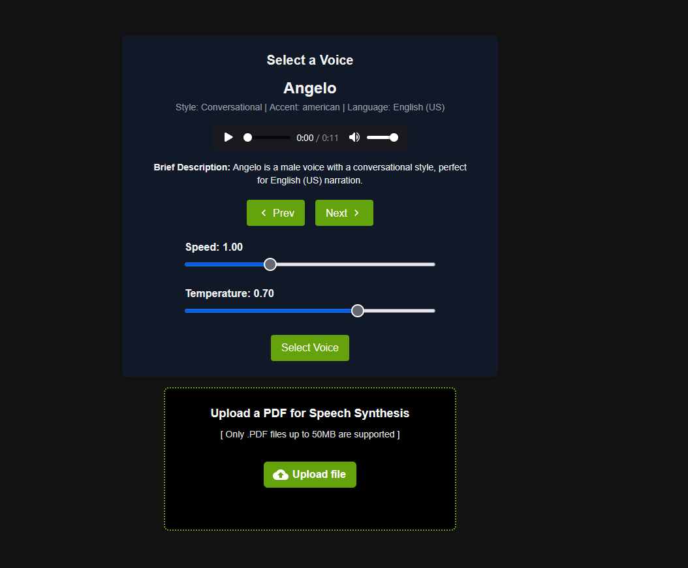
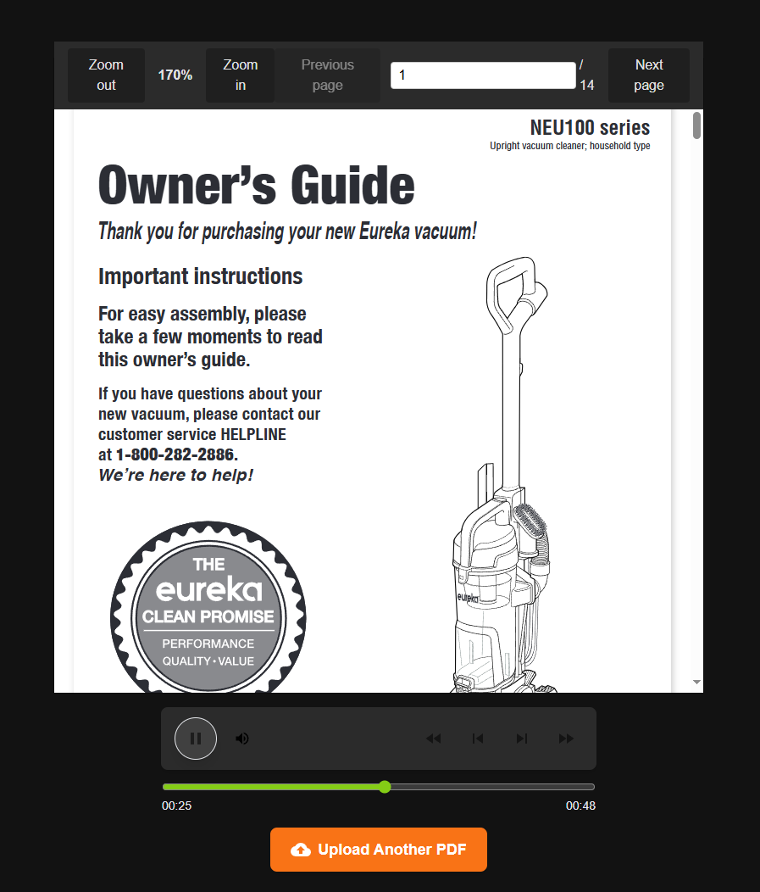

# PlayAI Book Reader

PlayAI Book Reader is a web application that allows users to upload and read PDF files with text-to-speech functionality using the PlayAI Text-to-Speech API. The application is built using **React, Next.js, TypeScript, and Material UI**, providing a seamless and responsive reading experience.


## Tech Stack


## Features

### PDF Upload:
Users can upload a PDF file through the web interface, enabling quick access to their documents. The user is also able to select from different voices and settings for the audio generation.

<p align="center">
  
</p>

---

### PDF Viewer and TTS:
Once uploaded, users can navigate through pages using next/previous buttons or a page number input. The app also converts text from the displayed page into speech using PlayAI's TTS API.

<p align="center">
  
</p>


## Design Decisons & Trade offs

- React & Next.js was choosen for their ability to simplify overhead when creating web-apps, allowing us to rapidly create an MVP
- TypesScript was choosen for for type saftey, reducing potential for runtime errors
- Material UI was choosen to spped up frontend development, particularlly with icons
- Third party libraries such as react-dropzone and react-pdf-viewer were utulized in order to speed up development time


## Installation & Setup

### Prerequisites:
- Node.js (v16+ recommended)
- npm or yarn
- PlayAI API Key

### Steps to Run Locally:

1. **Clone the repository:**
   ```bash
   git clone https://github.com/stevenpstansberry/book-reader.git
   cd book-reader
   ```

2. **Install dependencies:**
   ```bash
   npm install  # or yarn install
   ```

3. **Set up environment variables:**
   Create a `.env.local` file in the root directory and add your PlayAI API key:
   ```env
   NEXT_PUBLIC_PLAYAI_API_KEY=your_playai_api_key
   NEXT_PUBLIC_USER_ID=your_playai_user_id
   ```

4. **Run the development server:**
   ```bash
   npm run dev  # or yarn dev
   ```

5. **Open the app in your browser:**
   ```
   http://localhost:3000
   ```


### Future Improvements:
- Add voice chat widget
- Add more voices
